```mermaid
graph TB
    subgraph "Interfaces (Public API)"
        IDoc[DocumentOperations&lt;T&gt;]
        IQuery[QueryOperations&lt;T&gt;]
        IUpdate[UpdateOperations&lt;T&gt;]
        ISub[SubscribeOperations&lt;T&gt;]
    end
    
    subgraph "Services (Shared Logic)"
        UpdateSvc[UpdateOperationsService&lt;T&gt;]
        QuerySvc[QueryOperationsService&lt;T&gt;]
        SubSvc[SubscriptionService&lt;T&gt;]
    end
    
    subgraph "Base Classes (Pure Composition)"
        BaseDoc[FirestoreDocument&lt;T&gt;]
        BaseQuery[FirestoreQuery&lt;T&gt;]
        BaseColl[FirestoreCollection&lt;T&gt;]
    end
    
    subgraph "Generated Classes (Interface Implementation)"
        UserDoc[UserDocument]
        UserQuery[UserQuery]
        UserColl[UserCollection]
    end
    
    %% Interface implementations
    UserDoc -.->|implements| IDoc
    UserQuery -.->|implements| IQuery
    UserQuery -.->|implements| IUpdate
    UserColl -.->|implements| IQuery
    UserColl -.->|implements| IUpdate
    
    BaseDoc -.->|implements| IDoc
    BaseQuery -.->|implements| IQuery
    BaseQuery -.->|implements| IUpdate
    BaseColl -.->|implements| IQuery
    BaseColl -.->|implements| IUpdate
    
    %% Service composition
    UserDoc -->|has-a| UpdateSvc
    UserDoc -->|has-a| SubSvc
    UserQuery -->|has-a| QuerySvc
    UserQuery -->|has-a| UpdateSvc
    UserColl -->|has-a| QuerySvc
    UserColl -->|has-a| UpdateSvc
    
    BaseDoc -->|has-a| UpdateSvc
    BaseDoc -->|has-a| SubSvc
    BaseQuery -->|has-a| QuerySvc
    BaseQuery -->|has-a| UpdateSvc
    BaseColl -->|has-a| QuerySvc
    BaseColl -->|has-a| UpdateSvc
```

# 🏗️ Firestore ODM Refactoring Plan: Interface + Composition Architecture

## Overview

Refactor the Firestore ODM from a **mixin-based inheritance** architecture to a **pure Interface + Composition** architecture following SOLID principles.

## Current Architecture Analysis

### Two-Layer Architecture:

1. **Runtime Base Classes** (using mixins):
   - `FirestoreDocument<T>` with `UpdateOperationsMixin<T>`
   - `FirestoreQuery<T>` with `UpdateOperationsMixin<T>`
   - `FirestoreCollection<T>` extends `FirestoreQuery<T>`

2. **Generated Code** (using inheritance):
   - `UserCollection` extends `FirestoreCollection<User>`
   - `UserQuery` extends `FirestoreQuery<User>`
   - Extensions on `FirestoreDocument<User>`
   - `UserUpdateBuilder` extends `UpdateBuilder`

### Problems with Current Architecture:
- **Violates SOLID**: Mixing concerns in mixin
- **Inheritance chains**: Hard to test and extend
- **Generated code complexity**: Deep inheritance hierarchies
- **Tight coupling**: Update logic mixed with document/query logic

## 🎯 New Architecture: Interface + Composition

### 1. Core Interfaces (Public API Contract)

```dart
// packages/firestore_odm/lib/src/interfaces/query_operations.dart
abstract interface class QueryOperations<T> {
  Future<List<T>> get();
  QueryOperations<T> where(FirestoreFilter Function(FilterBuilder) builder);
  QueryOperations<T> orderBy(OrderByField Function(OrderByBuilder) builder);
  QueryOperations<T> limit(int limit);
  QueryOperations<T> limitToLast(int limit);
}

// packages/firestore_odm/lib/src/interfaces/update_operations.dart
abstract interface class UpdateOperations<T> {
  Future<void> update(List<UpdateOperation> Function(UpdateBuilder) builder);
  Future<void> modify(T Function(T) modifier);
  Future<void> incrementalModify(T Function(T) modifier);
}

// packages/firestore_odm/lib/src/interfaces/subscribe_operations.dart
abstract interface class SubscribeOperations<T> {
  Stream<T?> get changes;
  bool get isSubscribing;
}

// packages/firestore_odm/lib/src/interfaces/document_operations.dart
abstract interface class DocumentOperations<T> 
    extends UpdateOperations<T>, SubscribeOperations<T> {
  Future<T?> get();
  Future<void> set(T data);
  Future<void> delete();
  Future<bool> exists();
  Future<T> getOrCreate(T Function() create);
}
```

### 2. Composition Services (Shared Logic)

```dart
// packages/firestore_odm/lib/src/services/update_operations_service.dart
class UpdateOperationsService<T> {
  final DateTime specialTimestamp;
  final Map<String, dynamic> Function(T) toJson;
  final T Function(Map<String, dynamic>, [String?]) fromJson;
  
  const UpdateOperationsService(this.specialTimestamp, this.toJson, this.fromJson);
  
  // Extracted from UpdateOperationsMixin
  Map<String, dynamic> processUpdateData(Map<String, dynamic> data);
  Map<String, dynamic> computeDiff(Map<String, dynamic> old, Map<String, dynamic> new);
  Map<String, dynamic> computeDiffWithAtomicOperations(Map<String, dynamic> old, Map<String, dynamic> new);
  Map<String, dynamic> deepSerialize(Map<String, dynamic> data);
  
  // New methods for executing updates
  Future<void> executeUpdate(
    DocumentReference<Map<String, dynamic>> ref,
    List<UpdateOperation> Function(UpdateBuilder) builder,
  );
  
  Future<void> executeModify(
    DocumentReference<Map<String, dynamic>> ref,
    T Function(T) modifier,
    T? currentData,
  );
  
  Future<void> executeIncrementalModify(
    DocumentReference<Map<String, dynamic>> ref,
    T Function(T) modifier,
    T? currentData,
  );
}

// packages/firestore_odm/lib/src/services/query_operations_service.dart
class QueryOperationsService<T> {
  final Query<Map<String, dynamic>> query;
  final T Function(Map<String, dynamic>, [String?]) fromJson;
  
  const QueryOperationsService(this.query, this.fromJson);
  
  Future<List<T>> executeQuery();
  Query<Map<String, dynamic>> applyFilter(FirestoreFilter filter);
  Query<Map<String, dynamic>> applyOrderBy(OrderByField orderBy);
  Query<Map<String, dynamic>> applyLimit(int limit);
}

// packages/firestore_odm/lib/src/services/subscription_service.dart
class SubscriptionService<T> {
  final DocumentReference<Map<String, dynamic>>? ref;
  final T Function(Map<String, dynamic>, [String?]) fromJson;
  final StreamController<T?> _controller = StreamController.broadcast();
  StreamSubscription<DocumentSnapshot<Map<String, dynamic>>>? _subscription;
  
  SubscriptionService(this.ref, this.fromJson);
  
  Stream<T?> get changes => _controller.stream;
  bool get isSubscribing => _subscription != null;
  
  void startListening();
  void dispose();
}
```

### 3. Base Implementation Classes (Pure Composition)

```dart
// packages/firestore_odm/lib/src/firestore_document.dart
class FirestoreDocument<T> implements DocumentOperations<T> {
  final FirestoreCollection<T> collection;
  final String id;
  final UpdateOperationsService<T> _updateService;
  final SubscriptionService<T> _subscriptionService;
  
  FirestoreDocument(this.collection, this.id) :
    _updateService = UpdateOperationsService(
      collection.specialTimestamp,
      collection.toJson,
      collection.fromJson,
    ),
    _subscriptionService = SubscriptionService(
      collection.ref.doc(id),
      collection.fromJson,
    );
  
  DocumentReference<Map<String, dynamic>> get ref => collection.ref.doc(id);
  
  @override
  Future<void> update(List<UpdateOperation> Function(UpdateBuilder) builder) =>
    _updateService.executeUpdate(ref, builder);
    
  @override
  Future<void> modify(T Function(T) modifier) async {
    final current = await get();
    if (current != null) {
      await _updateService.executeModify(ref, modifier, current);
    }
  }
  
  // All other methods delegate to services...
}

// packages/firestore_odm/lib/src/firestore_query.dart
class FirestoreQuery<T> implements QueryOperations<T>, UpdateOperations<T> {
  final Query<Map<String, dynamic>> query;
  final T Function(Map<String, dynamic>, [String?]) fromJson;
  final Map<String, dynamic> Function(T) toJson;
  final DateTime specialTimestamp;
  final QueryOperationsService<T> _queryService;
  final UpdateOperationsService<T> _updateService;
  
  FirestoreQuery(this.query, this.fromJson, this.toJson, this.specialTimestamp) :
    _queryService = QueryOperationsService(query, fromJson),
    _updateService = UpdateOperationsService(specialTimestamp, toJson, fromJson);
  
  @override
  Future<List<T>> get() => _queryService.executeQuery();
  
  @override
  FirestoreQuery<T> where(FirestoreFilter Function(FilterBuilder) builder) {
    // Implementation using _queryService...
  }
  
  // All methods delegate to services...
}

// packages/firestore_odm/lib/src/firestore_collection.dart
class FirestoreCollection<T> implements QueryOperations<T>, UpdateOperations<T> {
  final CollectionReference<Map<String, dynamic>> ref;
  final T Function(Map<String, dynamic>, [String?]) fromJson;
  final Map<String, dynamic> Function(T) toJson;
  final DateTime specialTimestamp;
  final QueryOperationsService<T> _queryService;
  final UpdateOperationsService<T> _updateService;
  final Map<String, FirestoreDocument<T>> _cache = {};
  
  FirestoreCollection({
    required this.ref,
    required this.fromJson,
    required this.toJson,
    DateTime? specialTimestamp,
  }) : specialTimestamp = specialTimestamp ?? DateTime.utc(1900, 1, 1, 0, 0, 10),
       _queryService = QueryOperationsService(ref, fromJson),
       _updateService = UpdateOperationsService(
         specialTimestamp ?? DateTime.utc(1900, 1, 1, 0, 0, 10),
         toJson,
         fromJson,
       );
  
  FirestoreDocument<T> call(String id) {
    return _cache.putIfAbsent(id, () => FirestoreDocument(this, id));
  }
  
  // All methods delegate to services...
}
```

### 4. Updated Code Generation Strategy

#### Collection Generator Changes

```dart
// Generated code will implement interfaces instead of extending classes
class UserCollection implements QueryOperations<User>, UpdateOperations<User> {
  final CollectionReference<Map<String, dynamic>> ref;
  final QueryOperationsService<User> _queryService;
  final UpdateOperationsService<User> _updateService;
  final Map<String, FirestoreDocument<User>> _cache = {};
  
  UserCollection(FirebaseFirestore firestore) :
    ref = firestore.collection('users'),
    _queryService = QueryOperationsService(
      firestore.collection('users'),
      (data, [id]) => User.fromJson(FirestoreDataProcessor.processFirestoreData(data, documentIdField: 'id', documentId: id)),
    ),
    _updateService = UpdateOperationsService(
      DateTime.utc(1900, 1, 1, 0, 0, 10),
      (user) => DocumentIdHandler.removeDocumentIdField(
        FirestoreDataProcessor.serializeForFirestore(user.toJson()),
        'id',
      ),
      (data, [id]) => User.fromJson(FirestoreDataProcessor.processFirestoreData(data, documentIdField: 'id', documentId: id)),
    );
    
  @override
  Future<List<User>> get() => _queryService.executeQuery();
  
  @override
  UserQuery where(UserFilter Function(UserFilterBuilder) builder) {
    final filterBuilder = UserFilterBuilder();
    final filter = builder(filterBuilder);
    final newQuery = _queryService.applyFilter(filter);
    return UserQuery(_queryService, _updateService, newQuery);
  }
  
  FirestoreDocument<User> call(String id) {
    return _cache.putIfAbsent(id, () => FirestoreDocument(this, id));
  }
  
  // Other methods...
}
```

#### Query Generator Changes

```dart
class UserQuery implements QueryOperations<User>, UpdateOperations<User> {
  final QueryOperationsService<User> _queryService;
  final UpdateOperationsService<User> _updateService;
  final Query<Map<String, dynamic>> query;
  
  UserQuery(this._queryService, this._updateService, this.query);
  
  @override
  Future<List<User>> get() => _queryService.executeQuery();
  
  @override
  UserQuery where(UserFilter Function(UserFilterBuilder) builder) {
    final filterBuilder = UserFilterBuilder();
    final filter = builder(filterBuilder);
    final newQuery = _queryService.applyFilter(filter);
    return UserQuery(_queryService, _updateService, newQuery);
  }
  
  // Bulk update operations
  @override
  Future<void> update(List<UpdateOperation> Function(UserUpdateBuilder) builder) {
    return _updateService.executeBulkUpdate(query, builder);
  }
  
  // Other methods...
}
```

#### Document Generator Changes

```dart
// Instead of extensions, generate direct interface implementations
class UserDocument implements DocumentOperations<User> {
  final FirestoreDocument<User> _document;
  
  UserDocument(this._document);
  
  @override
  Future<void> update(List<UpdateOperation> Function(UserUpdateBuilder) builder) {
    return _document.update((updateBuilder) {
      final userBuilder = UserUpdateBuilder();
      return builder(userBuilder);
    });
  }
  
  // Delegate all other methods to _document...
}
```

## 📊 Architecture Diagram



## 🔧 Implementation Steps

### Phase 1: Extract Services from Mixin ✅ NEXT
1. Create `UpdateOperationsService<T>` from `UpdateOperationsMixin<T>`
2. Create `QueryOperationsService<T>` 
3. Create `SubscriptionService<T>`
4. Add unit tests for each service

### Phase 2: Define Interfaces
5. Create interface definitions in `packages/firestore_odm/lib/src/interfaces/`
6. Define `QueryOperations<T>`, `UpdateOperations<T>`, `SubscribeOperations<T>`, `DocumentOperations<T>`

### Phase 3: Refactor Base Classes
7. Remove `UpdateOperationsMixin<T>` from `FirestoreDocument<T>`
8. Remove inheritance chain from `FirestoreCollection<T>`
9. Convert to pure composition with service injection
10. Update constructors to use dependency injection

### Phase 4: Update Generators
11. Update `CollectionGenerator` to generate interface implementations
12. Update `QueryGenerator` to generate interface implementations
13. Update `DocumentGenerator` to generate interface implementations
14. Update `UpdateGenerator` for new service-based architecture

### Phase 5: Update Dependencies
15. Update imports/exports in `firestore_odm.dart`
16. Update tests to work with new architecture
17. Update documentation and examples

### Phase 6: Validation
18. Run all existing tests to ensure API compatibility
19. Performance testing to ensure no regressions
20. Integration testing with real Firestore

## ✅ SOLID Compliance & Benefits

### SOLID Principles:
- **S** - Single Responsibility: Each service has one clear purpose
- **O** - Open/Closed: Easy to add new operation types via new services  
- **L** - Liskov Substitution: All implementations are interchangeable via interfaces
- **I** - Interface Segregation: Small, focused interfaces for specific capabilities
- **D** - Dependency Inversion: Classes depend on service abstractions

### Key Benefits:
- **No Inheritance/Mixins**: Pure composition architecture
- **Better Testability**: Services can be mocked independently
- **Runtime Flexibility**: Services can be swapped or configured
- **Cleaner Generated Code**: Implements interfaces instead of extending classes
- **Easier Maintenance**: Clear separation between runtime and generated code
- **Better Performance**: No mixin method lookups

## 🧪 Migration Strategy

### Backward Compatibility:
- **100% API compatibility**: Existing code using `userDoc.modify()`, `usersQuery.update()` etc. will continue to work
- **Generated code changes**: Only internal implementation changes, public API remains the same
- **Gradual migration**: Services can be introduced incrementally

### Testing Strategy:
- Unit tests for each service in isolation
- Integration tests for composed classes
- Regression tests for existing functionality
- Performance benchmarks to ensure no degradation

## 📝 Success Criteria

1. **Zero breaking changes** to public API
2. **All existing tests pass** without modification
3. **Performance maintained** or improved
4. **SOLID principles** fully implemented
5. **No inheritance or mixins** in final architecture
6. **Services fully testable** in isolation
7. **Generated code is cleaner** and more maintainable

---

This refactoring transforms the Firestore ODM into a modern, SOLID-compliant architecture while maintaining complete backward compatibility and improving testability, maintainability, and extensibility.